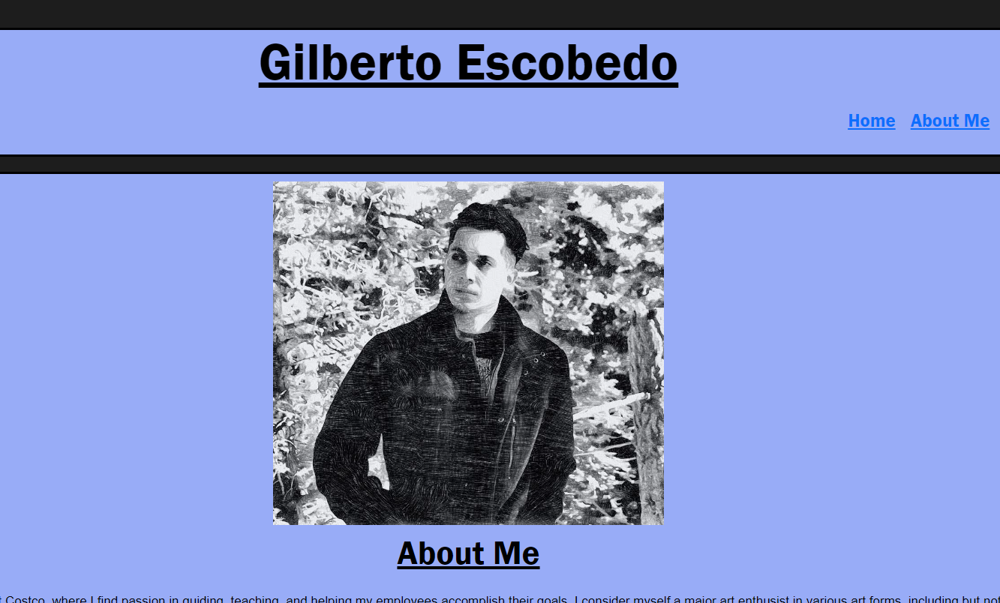

# React-Portfolio

Github Deployed Link: [https://n7-gil.github.io/React-Portfolio/]

The purpose of this assignment was to use React to create a functional website that served as our portfolio to display other projects we have done in our class as well as a Contact Me section that would provide options for users to contact me. Other requirements needed to include; our name, an image of ourselves and a working navigation that redirects to the section once clicked on.

